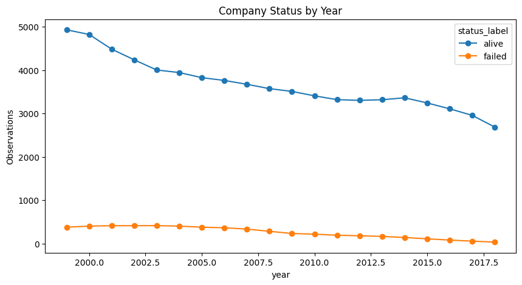
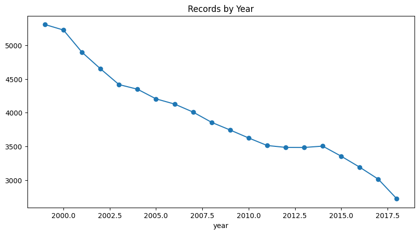
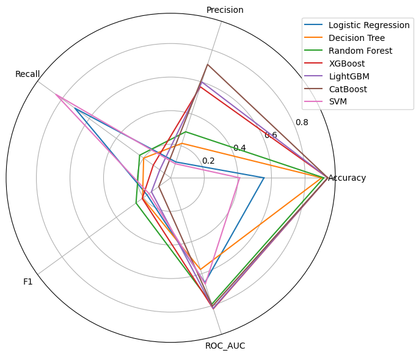
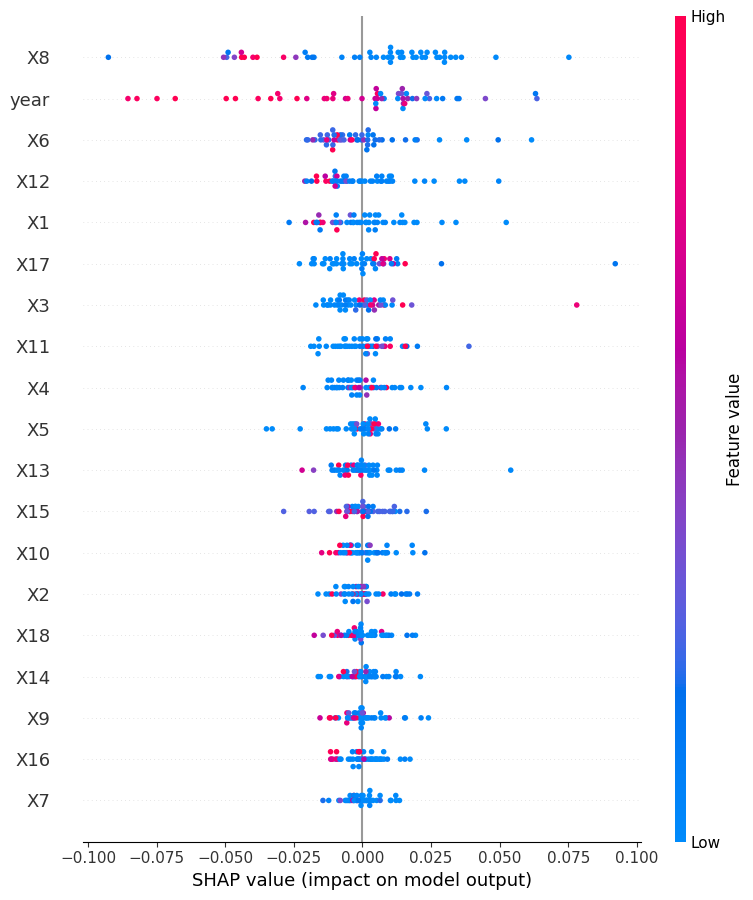
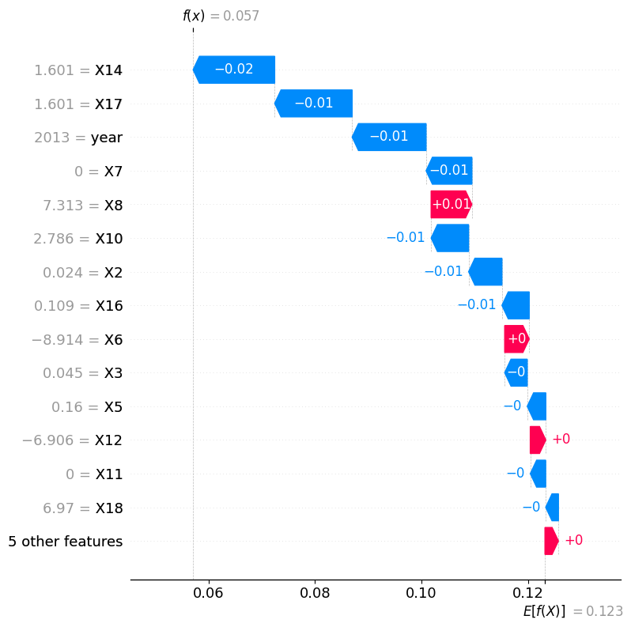
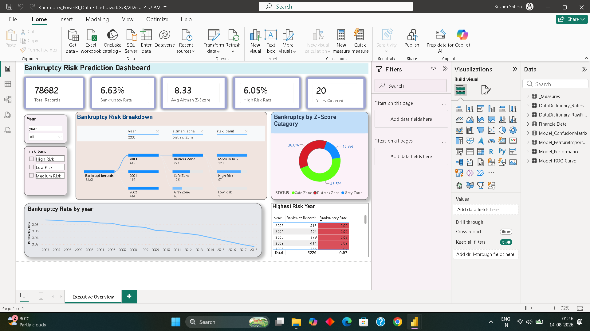

# Bankruptcy Early-Warning Screener


An end-to-end financial-risk analytics platform that identifies early warning signs of corporate distress from historical financial statements. The project moves from raw data and SQL analysis to machine-learning comparison, model explainability, and an analyst-facing Streamlit screening application.

**[Live demo](#) · [Video walkthrough](#)** <!-- TODO: replace with your Streamlit Community Cloud URL and/or a Loom/YouTube link -->


<!-- TODO: add a real screenshot — run `streamlit run app/streamlit_app.py`, screenshot the loaded screener, save to docs/images/app_screenshot.png -->

> **Decision-support only:** this project prioritises companies for human review. It is not a bankruptcy determination, lending decision, investment recommendation, or audit opinion.

## Contents

- [Skills demonstrated](#skills-demonstrated)
- [Business problem](#business-problem)
- [Proposed solution](#proposed-solution)
- [Dataset](#dataset)
- [Analysis workflow](#analysis-workflow)
- [Machine-learning evaluation](#machine-learning-evaluation)
- [Explainability and model assurance](#explainability-and-model-assurance)
- [SQL analytics](#sql-analytics)
- [Power BI dashboard](#power-bi-dashboard)
- [Deployment architecture](#deployment-architecture)
- [Outcomes and business value](#outcomes-and-business-value)
- [Limitations and responsible use](#limitations-and-responsible-use)
- [References](#references)
- [About](#about)

## Skills demonstrated

| Area | Tools / techniques |
|---|---|
| Data engineering | Pandas, data validation, SQL (PostgreSQL + SQLite), reproducible pipelines |
| Machine learning | XGBoost, LightGBM, CatBoost, Random Forest, SVM, Logistic Regression, stratified cross-validation, class-imbalance handling |
| Model explainability | SHAP (global + local), LIME, calibration, error analysis, fairness/bias assessment |
| Software engineering | Modular Python package (`src/`), unit tests (`pytest`), CI (GitHub Actions), Docker |
| Deployment & BI | Streamlit web app, Docker containerisation, Power BI dashboard |
| Domain expertise | Altman Z / Z'' score, Piotroski F-score, financial-statement ratio analysis |

## Business problem

Bankruptcy is rarely a single event; it is often preceded by declining profitability, weaker liquidity, rising leverage, and deteriorating cash generation. Credit analysts, lenders, investors, and corporate-finance teams need a disciplined way to flag those signals before losses materialise.

The core question is:

> Can a company’s historical financial features identify elevated bankruptcy risk early enough to support targeted analyst review?

## Proposed solution

The solution combines transparent financial screening and supervised machine learning:

1. **Ingest and validate** historical company-year financial data.
2. **Explore and clean** the data using reproducible Python and SQL workflows.
3. **Engineer features** and handle missing values, scaling, selection, and class imbalance.
4. **Train and compare** several classification models on the same stratified hold-out framework.
5. **Explain and validate** the selected model with SHAP/LIME, calibration, error analysis, learning curves, robustness, cross-validation, and fairness checks.
6. **Deploy a screening layer** that exposes interpretable Altman and Piotroski scorecards alongside the ML research workflow.

## Dataset

The project includes the complete analytical dataset in [`data/datasets/`](data/datasets/).

| File | Records | Purpose |
|---|---:|---|
| `american_bankruptcy.csv` | 78,682 | Original source dataset |
| `american_bankruptcy_cleaned.csv` | 78,682 | Cleaned analytical dataset |
| `american_bankruptcy_model_ready.csv` | 78,682 | Model-ready data with `status_label`, `year`, and `X1`–`X18` |

The dataset covers company-year observations from **1999–2018**. It contains 18 anonymised financial features and a binary outcome: `status_label` (`0` = active; `1` = failed/bankrupt). The target is imbalanced: approximately **6.6%** of observations are failed companies. Because the features are anonymised, the project deliberately reports them as `X1`–`X18` rather than inventing unsupported accounting definitions.

## Analysis workflow

```mermaid
flowchart LR
    A[Raw financial data] --> B[Profiling and quality assessment]
    B --> C[Cleaning and preprocessing]
    C --> D[EDA and feature engineering]
    D --> E[Model training and tuning]
    E --> F[Evaluation and calibration]
    F --> G[SHAP / LIME explainability]
    G --> H[SQL analytics + Streamlit screening]
    H --> I[Analyst review and action]
```



### EDA and data preparation

The executed notebooks examine the full analytical process:

| Stage | Work completed |
|---|---|
| Data understanding | Schema review, types, descriptive profiling, target distribution |
| Data quality | Missing-value analysis, duplicate checks, outlier review, quality validation |
| Univariate and bivariate EDA | Financial-feature distributions, class comparisons, correlations, and time trends |
| Preparation | Cleaning, target encoding, stratified splitting, imputation, scaling, and feature selection |
| Imbalance handling | Evaluation with the minority bankruptcy class explicitly considered |
| Business insight | Executive-focused time trends and financial-risk observations |

The detailed workbook map is available in [`notebooks/README.md`](notebooks/README.md). The PostgreSQL analysis workflow is documented in [`sql/portfolio/README.md`](sql/portfolio/README.md).

## Selected analysis evidence

The following charts are published from the project workflow to make the analytical story reviewable without opening a notebook.

<p align="center">
  
  
</p>

**Coverage and class context.** The annual record count declines across the historical panel, while failed observations form a much smaller series than active observations. This is why the modelling workflow uses stratified splits and evaluates recall, precision, F1, and ROC-AUC rather than accuracy alone.

## Machine-learning evaluation

Models were trained and evaluated on the same **80/20 stratified split** using `random_state=42`. Accuracy alone is misleading on a 6.6% positive class; the decision emphasis is on **ROC-AUC, recall, precision, and F1**.

| Model | Accuracy | Precision | Recall | F1 | ROC-AUC | Assessment |
|---|---:|---:|---:|---:|---:|---|
| **XGBoost** | 83.3% | 23.7% | 68.7% | **35.3%** | **85.7%** | **Selected research model** |
| LightGBM | 81.0% | 21.6% | **70.6%** | 33.1% | 85.4% | Highest recall; close alternative |
| Random Forest | **86.8%** | **25.4%** | 51.4% | 34.0% | 83.5% | Strong precision; lower distress capture |
| CatBoost | 75.9% | 17.9% | 73.6% | 28.8% | 83.4% | High recall; more false positives |
| SVM (RBF)* | 44.9% | 9.3% | **84.0%** | 16.8% | 68.3% | High alert volume; weak precision |
| Logistic Regression | 56.2% | 9.9% | 69.2% | 17.3% | 65.9% | Interpretable baseline |

\*SVM was trained on a stratified 20,000-row training subsample due to the computational cost of RBF probability estimates.

<p align="center">
  
</p>

**Model trade-off view.** The radar chart makes the operational trade-off explicit: some models maximise recall by generating more alerts, while XGBoost provides the best overall balance of discrimination and F1 for the stated triage use case.

### Selected model: XGBoost

**XGBoost is the selected research model** because it achieves the strongest overall balance of discrimination and minority-class usefulness: the highest ROC-AUC (85.7%) and F1 (35.3%), while identifying roughly 69 out of every 100 failed companies in the hold-out set.

Its 23.7% precision means that roughly one in four high-risk flags is a known failure in this test setup. That is appropriate for a **triage workflow**—where a false positive triggers further analysis—not for an automatic decision. LightGBM is a viable alternative when the business threshold values recall more heavily than precision.

## Explainability and model assurance

The research workflow includes:

- SHAP global feature importance and local explanations
- LIME local explanations
- Learning curves and overfitting review
- Probability calibration
- Error analysis
- Robustness stress testing
- Cross-validation stability checks
- Fairness / bias assessment

The compact published SHAP output is in [`analysis_outputs/shap_global_feature_importance.csv`](analysis_outputs/shap_global_feature_importance.csv). See the `07*` and `08*` notebooks for supporting analysis.

<p align="center">
  
  
</p>

**Explainability evidence.** The global summary ranks the anonymised model inputs by their impact on risk predictions; the waterfall chart decomposes one individual prediction into feature-level contributions. Since the source fields are anonymised, these charts are interpreted as model diagnostics, not as named accounting-ratio conclusions.

## SQL analytics

Two complementary SQL layers are included:

- [`sql/`](sql/) contains a lightweight SQLite-compatible schema and views for the deployable screener.
- [`sql/portfolio/`](sql/portfolio/) contains the full 11-step PostgreSQL portfolio: setup, import, quality checks, cleaning, EDA, feature engineering, windows, CTEs, views, procedures, and interview-ready queries.

## Power BI dashboard

A complementary executive dashboard is included at [`Dashboard/Bankruptcy_PowerBI_Data.pbix`](Dashboard/Bankruptcy_PowerBI_Data.pbix) for stakeholders who prefer a BI tool over the Streamlit app — company-year trends, risk-band distribution, and portfolio-level summary views built on the same cleaned dataset.


<!-- TODO: open the .pbix in Power BI Desktop, screenshot a page, save to docs/images/powerbi_dashboard.png -->

## Deployment architecture

| Layer | Implementation |
|---|---|
| Analyst interface | Streamlit application in `app/streamlit_app.py` |
| Financial scoring | Altman Z, Altman Z'', Piotroski F, and defensive ratio calculations in `src/` |
| Batch processing | `python -m src.pipeline` |
| ML research | Reproducible training utility in `src/train.py` and notebooks |
| Data store | SQLite demo schema and PostgreSQL portfolio scripts |
| Quality | Pytest suite and GitHub Actions CI |
| Container | Dockerfile for portable deployment |

### Run locally

```bash
git clone https://github.com/suvampriyaranjansahoo/Financial-Analytics-Bankruptcy-Prediction-Suite.git
cd Financial-Analytics-Bankruptcy-Prediction-Suite
python -m venv .venv
# Windows: .venv\Scripts\activate
pip install -r requirements.txt
streamlit run app/streamlit_app.py
```

Run tests and a sample screen:

```bash
pytest -q
python -m src.pipeline --input data/sample_financials.csv --output data/processed/screened_companies.csv
```

### Deploy with Docker

```bash
docker build -t bankruptcy-screener .
docker run -p 8501:8501 bankruptcy-screener
```

For Streamlit Community Cloud, use `app/streamlit_app.py` as the entry point. See [`docs/08_Deployment.md`](docs/08_Deployment.md).

## Power BI executive dashboard

The Power BI executive overview turns the same risk workflow into a finance-leadership view: portfolio size, bankruptcy rate, average Altman Z-Score, high-risk rate, risk-band breakdown, annual trend, and highest-risk periods. The supporting PBIX and Excel model remain local development artefacts; the dashboard screenshot below is committed as portfolio evidence.

<p align="center">
  
</p>

### Deployment preview

`images/deployment/` is reserved for a final `streamlit_demo.gif` screen recording once the Streamlit dashboard has been run locally or deployed. Adding a real interaction recording—rather than an artificial GIF made from a static screenshot—will give recruiters and reviewers an accurate view of the deployed product.

## Outcomes and business value

- A reproducible, end-to-end bankruptcy-risk analytics portfolio.
- A clear evidence trail from data quality through model selection and explanation.
- An ML triage model that can focus analyst attention on higher-risk company-years.
- Transparent finance scorecards to complement the less interpretable ML workflow.
- SQL and dashboard-ready outputs for credit-risk, investment-research, and due-diligence teams.

## Limitations and responsible use

- Features are anonymised; business interpretation of individual `X` fields is constrained.
- The data is historical and does not include macroeconomic, sector, or real-time market information.
- The reported split is a research benchmark; operational use requires time-aware validation, threshold governance, monitoring, and periodic retraining.
- Scores and predictions require expert review with filings, liquidity facilities, covenants, auditor commentary, and industry context.

Read [`docs/07_Model_Governance.md`](docs/07_Model_Governance.md) before any material use.

## References

- Altman, E. I. (1968). *Financial Ratios, Discriminant Analysis and the Prediction of Corporate Bankruptcy*.
- Piotroski, J. D. (2000). *Value Investing: The Use of Historical Financial Statement Information to Separate Winners from Losers*.
- U.S. Securities and Exchange Commission, EDGAR filing database.

## License

MIT — see [LICENSE](LICENSE).

## About

Built by **Suvam Priyaranjan Sahoo** as an end-to-end portfolio project spanning SQL, machine learning, model explainability, and deployment.

<!-- TODO: fill in — pick whichever of these you actually want public -->
[LinkedIn](#) · [Portfolio](#) · [Email](#)
